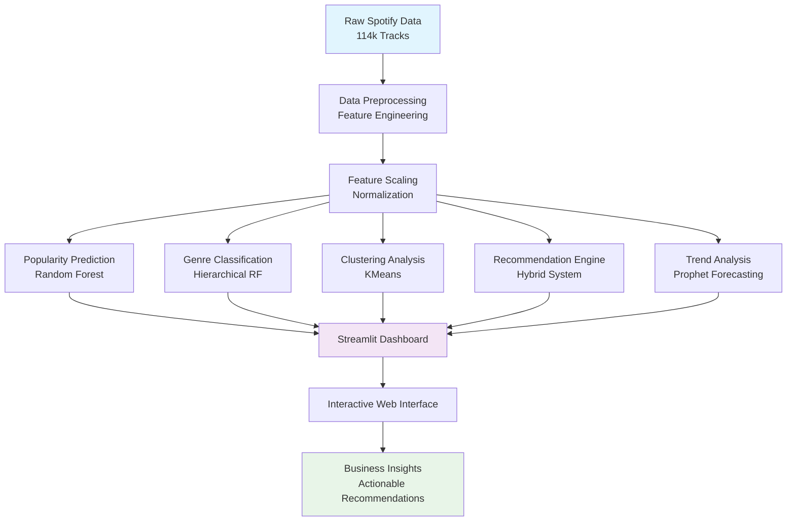

# AI-Powered Music Analysis Dashboard

An intelligent music analytics platform combining machine learning, trend analysis, and interactive visualization to provide data-driven insights for the music industry.


## Live Demo

[](https://spotify-genre-classifier-recommender-5lkprqoqqnb2d6nnqukrpp.streamlit.app/)

**Experience the full interactive dashboard:** [Music Analysis Dashboard](https://spotify-genre-classifier-recommender-5lkprqoqqnb2d6nnqukrpp.streamlit.app/)

*Click the badge above or the link to access the live Streamlit application and explore all features in real-time.*

## Table of Contents
1. [Problem Statement](#problem-statement)
2. [Project Overview](#project-overview)
3. [Business Use Case](#business-use-case)
4. [Model Performance Summary](#model-performance-summary)
5. [Key Research Findings](#key-research-findings)
6. [Business Insights and Suggestions](#business-insights-and-suggestions)
7. [Technical Architecture](#technical-architecture)
8. [Technology Used](#technology-used)
9. [Dashboard Modules](#dashboard-modules)
10. [Installation & Setup](#installation--setup)
11. [Project Structure](#project-structure)
12. [Target Users](#target-users)
13. [Future Enhancements](#future-enhancements)
14. [Research Methodology](#research-methodology)
15. [Contributing](#contributing)
16. [License](#license)
17. [References](#references)
18. [Author](#author)

## Problem Statement

The music industry faces significant challenges in understanding what makes a song commercially successful and how musical preferences evolve over time. Key problems include:

- **Unpredictable Commercial Success**: Artists and producers struggle to identify which musical characteristics drive popularity and commercial success
- **Genre Classification Challenges**: Manual genre labeling is subjective, inconsistent, and doesn't scale with the volume of new music releases
- **Ineffective Music Discovery**: Traditional recommendation systems fail to capture nuanced musical similarities and user preferences
- **Lack of Trend Insights**: Industry professionals need data-driven insights into evolving musical trends to make informed decisions
- **Limited Analytical Tools**: Existing tools don't provide comprehensive, actionable insights combining multiple analytical approaches

This project addresses these challenges by developing an AI-powered platform that provides predictive analytics, intelligent classification, and trend forecasting for the music industry.

## Project Overview

This comprehensive music analysis system leverages a dataset of **114,000+ tracks** to provide actionable insights for artists, producers, streaming platforms, and music industry professionals. The platform combines multiple AI models and analytical approaches to understand musical patterns, predict commercial success, and identify emerging trends.

### System Architecture



### Key Features
- **Popularity Prediction**: ML-powered commercial success forecasting
- **Hierarchical Genre Classification**: Two-level genre taxonomy with 90%+ accuracy for key genres
- **Smart Recommendations**: Hybrid content-based recommendation engine
- **Clustering Analysis**: Natural groupings of similar musical styles
- **Feature Importance**: SHAP-powered interpretability analysis
- **Trend Forecasting**: Historical pattern analysis with future predictions

## Business Use Case

### Primary Use Cases

**1. Artist & Producer Optimization**
- Predict commercial success potential before release
- Optimize musical features for target audiences
- Understand genre positioning strategies
- Data-driven composition and production decisions

**2. Streaming Platform Enhancement**
- Improve recommendation algorithm accuracy
- Automated content categorization at scale
- Trend-based playlist curation
- User preference pattern analysis

**3. Music Industry Intelligence**
- A&R talent screening and discovery
- Market trend identification and forecasting
- Genre evolution tracking
- Commercial viability assessment

**4. Content Creation Support**
- Soundtrack selection for media projects
- Mood-based music curation
- Brand alignment through musical characteristics
- Audience targeting optimization

## Model Performance Summary

### Popularity Prediction
- **Algorithm**: Random Forest Regressor
- **R² Score**: 0.5539
- **MAE**: 10.54
- **MSE**: 221.33
- **Key Insight**: Valence (happiness) is the strongest predictor of commercial success

### Genre Classification (Hierarchical)
| Performance Tier | Accuracy | Genres |
|-----------------|----------|---------|
| **Exceptional (90%+)** | 99%, 95%, 92% | Country, Hip-Hop, Ambient |
| **Strong (70-89%)** | 70-87% | Children, Folk, Classical, Pop, Japanese |
| **Moderate (50-69%)** | 52-69% | World, Metal, Rock |
| **Challenging (<50%)** | 44-48% | Electronic, Latin, Miscellaneous |

### Recommendation System
- **Precision**: 1.00 (perfect across all genres)
- **Average Recall**: 0.0063 (optimized for relevance)
- **Architecture**: Hybrid content + metadata-based filtering

### Clustering Analysis
- **Algorithm**: KMeans (k=5)
- **Silhouette Score**: 0.155
- **Result**: 5 meaningful musical clusters with distinct characteristics


*3D visualization of music clusters showing distinct groupings based on audio features*


*DBSCAN clustering comparison showing density-based groupings*

## Key Research Findings

### Feature Importance Analysis


*SHAP analysis revealing the most influential features for popularity prediction*

**Primary Drivers (High Impact)**:
1. **Valence**: Happy songs = higher popularity
2. **Instrumentalness**: Vocals essential for mainstream success
3. **Acousticness**: Produced sound > acoustic for commercial appeal

**Secondary Factors**: Energy, Danceability, Duration
**Minimal Impact**: Key, Mode, Time Signature

### Temporal Trends (1990-2022)


*Historical valence trends and future predictions showing U-shaped pattern*

**Valence (Musical Positivity)**
- **Pattern**: U-shaped curve
- **1990-2005**: Gradual decline in positivity
- **2005-2022**: Steady recovery
- **Future Forecast**: Continued upward trend (post-pandemic optimism)


*Tempo evolution over time with Prophet forecasting model predictions*

**Tempo Evolution**
- **Pattern**: Inverted U-curve
- **1990s-2000s**: Rising to ~123 BPM peak
- **Post-2010**: Decline to ~119 BPM (2022)
- **Future Forecast**: Further slowdown to ~110 BPM by 2027

## Business Insights and Suggestions

### For Artists & Producers

**Optimization Strategies**:
1. **Prioritize Positive Emotions**: Incorporate higher valence (happiness/positivity) in compositions
2. **Include Vocal Elements**: Avoid purely instrumental tracks for mainstream appeal
3. **Enhanced Production**: Consider electronic/produced elements over purely acoustic sounds
4. **Energy Balance**: Target moderate-to-high energy levels for broader appeal

**Genre-Specific Recommendations**:
- **Country/Hip-Hop Artists**: Leverage high classification accuracy for clear positioning
- **Electronic/Latin Artists**: Focus on distinctive sub-genre characteristics due to classification challenges
- **Emerging Artists**: Monitor tempo trend toward slower, more atmospheric sounds

### For Streaming Platforms

**Algorithm Enhancement**:
1. **Feature Weighting**: Prioritize valence, instrumentalness, and acousticness in recommendation systems
2. **Playlist Curation**: Emphasize vocal-driven, upbeat tracks in popular playlists
3. **Trend Adaptation**: Prepare algorithms for continued tempo slowdown (lo-fi, chill genres)
4. **Genre Intelligence**: Implement hierarchical classification for better content organization

**User Experience Improvements**:
- Mood-based recommendations using valence patterns
- Genre-specific recommendation confidence scoring
- Temporal trend integration for discovery features

### For Music Industry Professionals

**Market Intelligence**:
1. **Commercial Success Patterns**: Recognize that popularity drivers are highly genre-specific
2. **Emerging Trends**: Prepare for shift toward slower, more atmospheric soundscapes
3. **Cultural Insights**: Post-pandemic shift toward happier, more optimistic music
4. **Investment Decisions**: Use predictive analytics for artist development and marketing spend

**Strategic Planning**:
- Focus marketing efforts on high-valence content
- Develop genre-specific success metrics
- Invest in vocal talent and production quality
- Monitor tempo trends for genre positioning

## Technical Architecture

### Data Pipeline
```
Raw Spotify Data (114k tracks) 
    ↓
Feature Engineering & Scaling
    ↓
Multiple ML Pipelines:
├── Popularity Prediction (Random Forest)
├── Genre Classification (Hierarchical RF)
├── Clustering Analysis (KMeans)
├── Recommendation Engine (Hybrid)
└── Trend Analysis (Prophet Forecasting)
    ↓
Interactive Streamlit Dashboard
```

### Audio Features Analyzed (15+ dimensions)
- **Emotional**: Valence, Energy, Danceability
- **Vocal**: Speechiness, Instrumentalness, Liveness
- **Production**: Acousticness, Loudness, Tempo
- **Structural**: Duration, Key, Mode, Time Signature

## Technology Used

### Core Technologies
- **Python 3.8+**: Primary programming language
- **Streamlit**: Interactive web application framework
- **scikit-learn**: Machine learning algorithms and evaluation
- **pandas & numpy**: Data manipulation and numerical computing
- **plotly**: Interactive visualizations and charts

### Machine Learning Stack
- **Random Forest**: Classification and regression models
- **SHAP**: Model interpretability and feature importance
- **KMeans & DBSCAN**: Clustering algorithms
- **Facebook Prophet**: Time series forecasting
- **Cosine Similarity**: Recommendation system calculations

### Data Processing & Visualization
- **StandardScaler**: Feature normalization and scaling
- **t-SNE & PCA**: Dimensionality reduction for visualization
- **Joblib**: Model serialization and deployment
- **Matplotlib & Seaborn**: Statistical visualizations

### Development & Deployment
- **Jupyter Notebooks**: Analysis and experimentation
- **Git**: Version control and collaboration
- **Google Drive API**: Model and data storage
- **Streamlit Cloud**: Web application hosting

## Dashboard Modules

### App Overview
Comprehensive introduction to all features and capabilities

### Popularity Prediction
- Interactive feature sliders with real-time prediction
- Optimization suggestions based on feature importance
- Commercial success scoring (0-100 scale)
- SHAP-powered interpretability insights

### Genre Classification
- Hierarchical classification (Super → Sub genres)
- Confidence scoring for reliability assessment
- Genre-specific performance insights
- 10+ major category coverage

### Music Recommendations
- Search-based track discovery
- Hybrid similarity matching
- Multi-factor weighting system
- Top-10 precision-optimized results

### Dataset Insights
- Interactive genre distribution analysis
- Audio feature pattern exploration
- Model training performance metrics
- Data quality and coverage statistics

## Installation & Setup

### Prerequisites
```bash
Python 3.8+
pip package manager
```

### Installation Steps
```bash
# Clone repository
git clone https://github.com/yourusername/music-analysis-dashboard.git
cd music-analysis-dashboard

# Install dependencies
pip install -r requirements.txt

# Run Streamlit app
streamlit run dashboard.py
```

### Required Packages
```
streamlit>=1.28.0
pandas>=1.5.0
numpy>=1.24.0
scikit-learn>=1.3.0
plotly>=5.15.0
shap>=0.42.0
joblib>=1.3.0
gdown>=4.7.0
fbprophet>=0.7.1
```

## Project Structure

```
music-analysis-dashboard/
├── dashboard.py                 # Main Streamlit application
├── models/                     # Trained ML models
│   ├── rf_popularity_cluster.pkl
│   ├── super_genre_model.pkl
│   ├── hierarchical_scaler.pkl
│   └── feature_matrix.npy
├── data/                       # Dataset files
│   └── df_merged.pkl          # Main processed dataset
├── notebooks/                  # Analysis notebooks
│   ├── popularity_modeling.ipynb
│   ├── genre_classification.ipynb
│   ├── clustering_analysis.ipynb
│   ├── recommendation_system.ipynb
│   └── trend_analysis.ipynb
├── images/                     # Visualization assets
│   ├── cluster_analysis_3d.png
│   ├── dbscan_clustering.png
│   ├── shap_feature_importance.png
│   ├── valence_trend_forecast.png
│   └── tempo_trend_forecast.png
├── requirements.txt
├── LICENSE                     # Apache 2.0 License
└── README.md
```

## Target Users

### Music Creators
- **Artists**: Optimize tracks for commercial success
- **Producers**: Data-driven production decisions
- **Songwriters**: Understand popularity patterns

### Industry Professionals  
- **A&R Teams**: Talent screening and discovery
- **Playlist Curators**: Content organization and selection
- **Music Marketers**: Genre positioning and targeting
- **Streaming Platforms**: Algorithm enhancement

### Content Creators
- **Video Producers**: Soundtrack selection
- **Podcast Creators**: Background music curation
- **App Developers**: Music integration insights

## Future Enhancements

### Planned Features
- **Real-time Audio Analysis**: Upload and analyze custom tracks
- **Advanced Trend Predictions**: Multi-feature forecasting
- **Genre Evolution Tracking**: Sub-genre emergence patterns  
- **Collaborative Filtering**: User-based recommendations
- **API Integration**: Spotify/Apple Music connectivity
- **Mobile Optimization**: Responsive design improvements

### Research Extensions
- **Emotion Detection**: Advanced sentiment analysis
- **Cultural Impact Analysis**: Regional music preferences
- **Artist Career Modeling**: Success trajectory prediction
- **Cross-platform Analytics**: Multi-service comparison

## Research Methodology

### Data Collection
- **Source**: Spotify Web API + curated music databases
- **Size**: 114,000+ professionally catalogued tracks
- **Features**: 15+ audio characteristics per track
- **Quality**: Cleaned, validated, and preprocessed

### Model Development
- **Validation**: Train/test splits with cross-validation
- **Feature Engineering**: Scaling, normalization, interaction terms
- **Hyperparameter Tuning**: Grid search with performance optimization
- **Interpretability**: SHAP values for model transparency

### Evaluation Metrics
- **Classification**: Accuracy, Precision, Recall, F1-score
- **Regression**: R², MAE, MSE
- **Clustering**: Silhouette score, visual coherence
- **Recommendations**: Precision@10, Recall@50

## Contributing

Contributions are welcome! Please feel free to submit a Pull Request.

### Development Setup
```bash
# Fork the repository
# Clone your fork
git clone https://github.com/yourusername/music-analysis-dashboard.git

# Create feature branch
git checkout -b feature/amazing-feature

# Make changes and commit
git commit -m "Add amazing feature"

# Push to branch
git push origin feature/amazing-feature

# Submit Pull Request
```

## License

This project is licensed under the Apache License 2.0 - see the [LICENSE](LICENSE) file for details.

## References

1. Schedl, M., Gómez, E., & Urbano, J. (2014). Music information retrieval: Recent developments and applications. *Foundations and Trends in Information Retrieval*, 8(2-3), 127-261.

2. Bertin-Mahieux, T., Ellis, D. P., Whitman, B., & Lamere, P. (2011). The Million Song Dataset. *Proceedings of the 12th International Society for Music Information Retrieval Conference*.

3. Spotify Web API. (2023). Audio Features Object. Retrieved from https://developer.spotify.com/documentation/web-api/reference/get-audio-features

4. Lundberg, S. M., & Lee, S. I. (2017). A unified approach to interpreting model predictions. *Advances in Neural Information Processing Systems*, 30.

5. Taylor, S. J., & Letham, B. (2018). Forecasting at scale. *The American Statistician*, 72(1), 37-45.

6. Breiman, L. (2001). Random forests. *Machine Learning*, 45(1), 5-32.

7. Tzanetakis, G., & Cook, P. (2002). Musical genre classification of audio signals. *IEEE Transactions on Speech and Audio Processing*, 10(5), 293-302.

8. Celma, Ò. (2010). *Music recommendation and discovery: The long tail, long fail, and long play in the digital music space*. Springer Science & Business Media.

## Author

**[Your Name]**

Data Scientist & Music Technology Enthusiast

- **Portfolio**: [https://yourportfolio.com](https://yourportfolio.com)
- **LinkedIn**: [linkedin.com/in/yourprofile](https://linkedin.com/in/yourprofile)
- **GitHub**: [github.com/yourusername](https://github.com/yourusername)
- **Email**: your.email@example.com
- **Medium**: [medium.com/@yourusername](https://medium.com/@yourusername)

*Passionate about leveraging data science and machine learning to unlock insights in the music industry. Combining technical expertise with domain knowledge to create impactful solutions for artists, producers, and music professionals.*

---

**Transforming music analysis through data science - one insight at a time**
